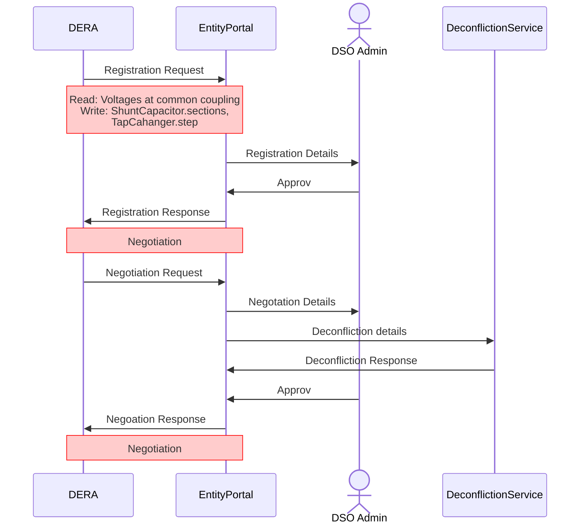

# GOSS-ADMS

This repository contains source code for GridApps-D core platform. This platform utilizes GOSS framework. 
For documentation see: http://gridappsd.readthedocs.io/en/releases-0.1/

```mermaid

sequenceDiagram
    %%{init:{"themeVariables": { "noteBkgColor": "#ffcccc", "noteTextColor": "#333", "noteBorderColor": "#ff0000" } }}%%
    DERA->>EntityPortal: Registration Request
    Note over DERA,EntityPortal: Read: Voltages at common coupling <br/> Write: ShuntCapacitor.sections, <br/>TapCahanger.step
    actor DSO Admin
    EntityPortal->>DSO Admin: Registration Details
    DSO Admin->>EntityPortal: Approv
    EntityPortal->>DERA: Registration Response
    
    Note over DERA,EntityPortal: Negotiation
    DERA->>EntityPortal:Negotiation Request
    EntityPortal->>DSO Admin: Negotation Details
    EntityPortal->>DeconflictionService: Deconfliction details
    DeconflictionService->>EntityPortal: Deconfliction Response
    DSO Admin->>EntityPortal: Approv
    EntityPortal->>DERA: Negoation Response

    Note over DERA,EntityPortal: Negotiation

    
    
```
